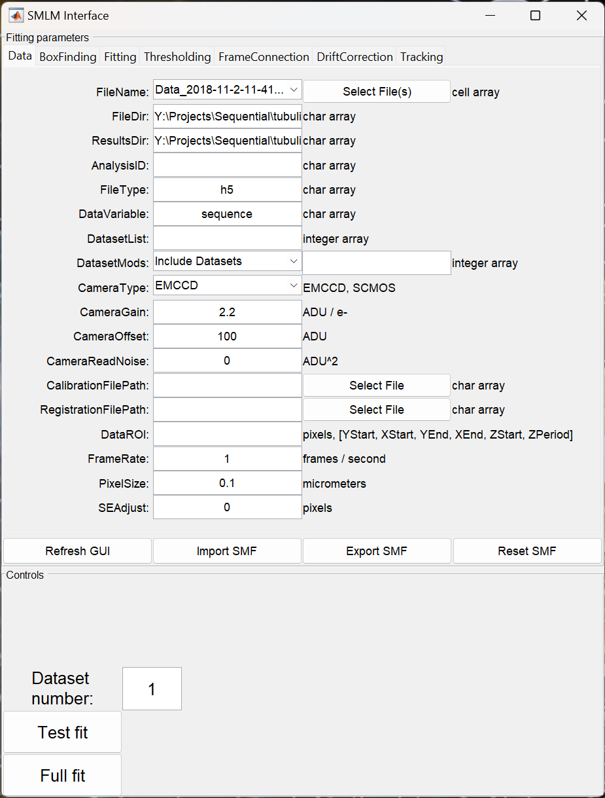
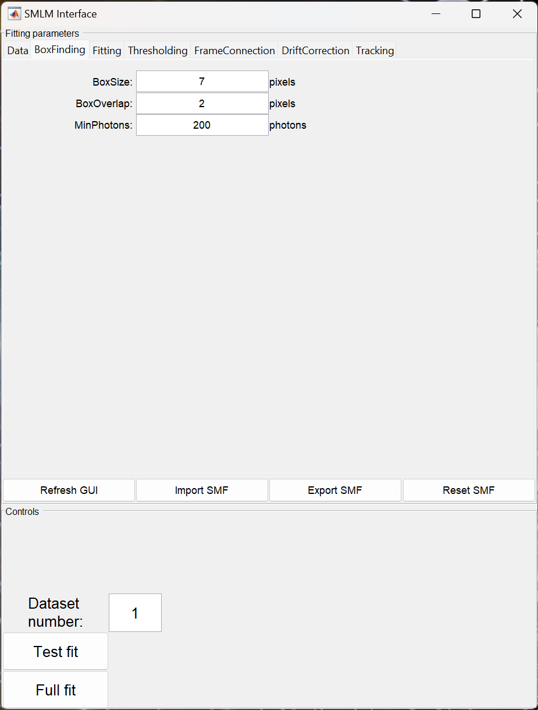
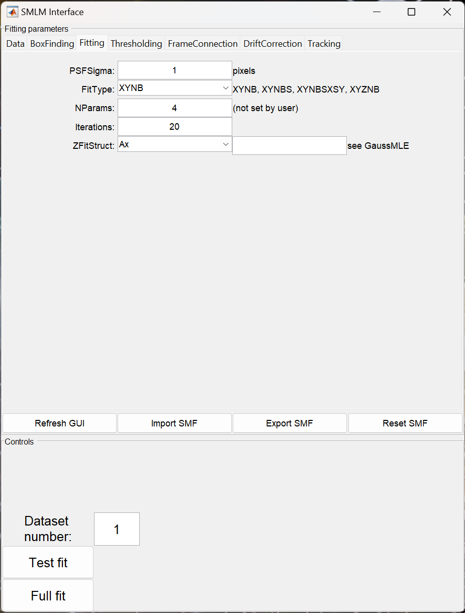
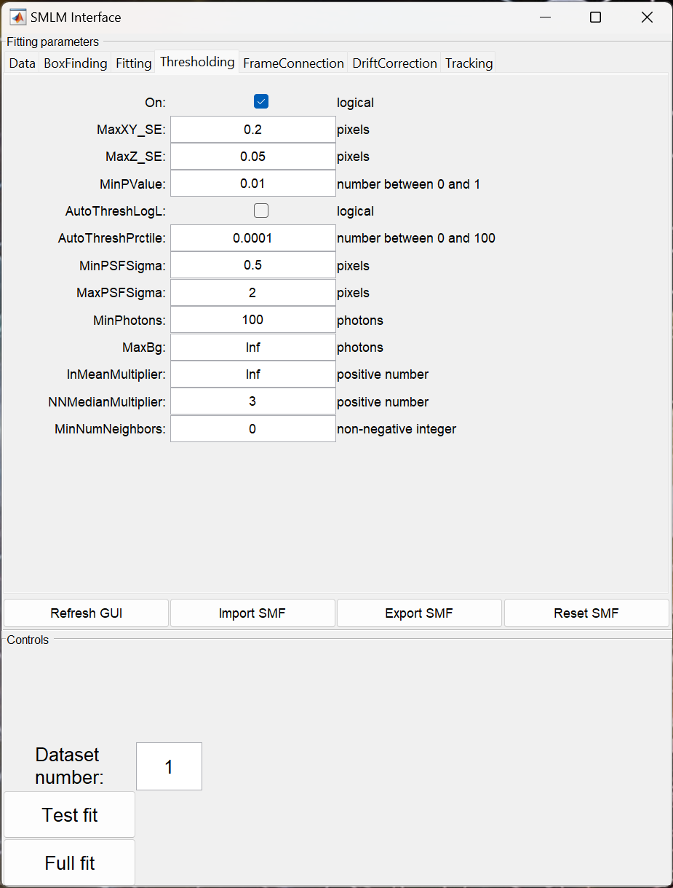
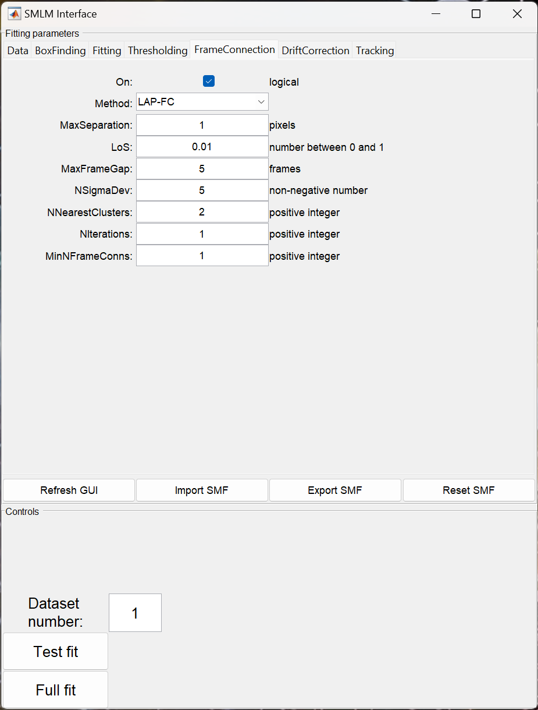
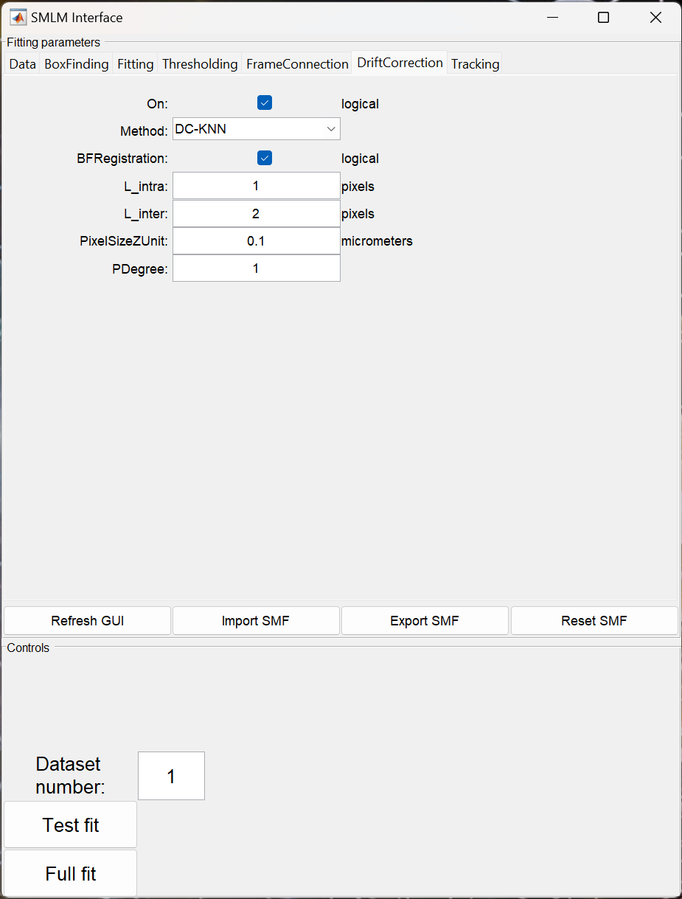

### SMLM GUI

A comprehensive software platform for single-molecule localization
microscopy's raw data fitting and subsequent analysis. 

#### Graphical User Interface (GUI) Parameters:

The ***smite*** GUI allow advanced data analysis without any programming
experience. In this guide, we present detailed step-by-step protocols on
how to analyze SMLM data using ***smite***. The ***smite*** GUI can be
initialized by typing the command `smi.SMLM()` in MATLAB. Figure 1 shows
the main SMLM Interface. Note that most GUI elements have tool tips:
hover with the mouse over to the control to display it. The components
of the GUI are briefly explained here:

1. **Data:**  In this part of the GUI, a data file can be imported. We
   provide two different functionalities for data anaysis. One is *Test fit*
   in which a single dataset is processed for a quick idea of how well the
   analysis parameters work; the other is *Full fit* which does a complete
   analysis of all datasets.

    - FileName: Name of the raw data file you wish to analyze. Files
      can be selected by the button `Select File(s)`
    - FileDir: Name of directory containing the raw data file
    - ResultsDir: Name of directory in which results will be saved
    - Analysis ID: Optional identifier to be tagged onto the filenames
      of saved results
    - FileType: Type of raw data file, e.g., mat or h5
    - DataVariable: Name of variable in raw data .mat file(s) containing
      the data
    - DatasetList: Array specifying the dataset number(s) to be analyzed
    - DatasetMods: This drop-down menu allows you to include/exclude
      specific datasets from analysis
    - CameraType: The type of a camera used to collect raw data. This
      drop-down menu includes EMCCD or sCMOS cameras
    - CameraGain: Gain of a camera used to collect raw data
    - CameraOffset: Offset of a camera used to collect raw data
    - CameraReadNoise: Variance of the read-noise of a camera used to
      collect raw data
    - CalibrationFilePath: Path to camera calibration file to be used;
      see [CalibrationFile](../FileFormats/CalibrationFile.md)
    - RegistrationFilePath: Path to channel registration file containing
      a transform applied to the data.
    - DataROI: Region-of-Interest of camera (optional)
    - FrameRate: Acquisition frame rate of a camera used to collect raw data
    - PixelSize: Pixel size of a camera used to collect raw data,
      back-projected to the objective focal plane (um)
    - SEAdjust: Standard error inflation applied to each localization

* In the GUI, we have different buttons whose functionality is provided below:

    - Import SMF: This button allows you to import an SMF structure
      saved in a .mat file
    - Export SMF: This button allows you to export the current settings
      displayed in this GUI to an SMF structure in a .mat file
    - Reset SMF: This button allows you to reset current settings to their
      default values defined in the `smi_core.SingleMoleculeFitting` class

 Figure 1

2. **BoxFinding:** Box finding finds and collates subregions of local
   maxima from a stack of 2D images. Local maxima are used as the center
   of ROIs if the estimated single molecule intensity is greater than
   MinPhotons. The fields are:

    - BoxSize: Linear box size for fitting (pixels)
    - BoxOverlap: Overlap of boxes (pixels)
    - MinPhotons: Minimum number of photons allowed from an emitter.

 Figure 2

3. **Fitting:** Fits a 2D Gaussian blob model to the each image in a
   stack of 2D images. The fields are:

    - PSFSigma: Known or initial PSF Sigma (pixels) which can be scalar
      or an array [SigmaX SigmaY]
    - FitType: In the GUI, several fit types ('XYNB', 'XYNBS', 'XYNBSXSY',
      'XYZNB') are available. Here X & Y are lateral and Z is the axial
      dimension, N is number of photons, B is background, S is the PSF
      sigma, and SX & SY are standard errors (uncertainty) in the lateral
      dimensions
    - NParams: Number of fitting parameters based on the chosen FitType
      (user does not need to set this)
    - Iterations: Newton-Raphson iterations
    - ZFitStruct: Structure for astigmatic fitting with fields in
      drop-down menu.

 Figure 3

4. **Thresholding:** This part of the GUI thresholds localizations based
   on various set properties of the localizations. The thresholding can be
   set On in the start. The fields are:
    
    - MaxXY_SE: Maximum value of X or Y standard error of localizations
      retained after thresholding
    - MaxZ_SE: Maximum value of Z standard error of localizations retained
      after thresholding
    - MinPValue: Minimum value of the p-value of localizations retained
      after thresholding. In this context, p-value is bigger for good
      localizations and smaller for bad localizations
    - AutoThreshLogL: Automatically select threshold for log-likelihood
      using the triangle method and use it in place of MinPValue threshold
    - AutoThreshPrctile: Percentile of extrema of log-likelihood thrown
      out before computing auto-threshold when using AutoThreshLogL
    - MinPSFSigma: Minimum value of PSF sigma of localizations retained
      after thresholding
    - MaxPSFSigma: Maximum value of PSF sigma of localizations retained
      after thresholding
    - MinPhotons: Minimum number of photons in localizations retained
      after thresholding
    - MaxBg: Maximum number of background photons in localizations
      retained after thresholding
    - InMeanMultiplier: Intensity mean multiplier defining maximum
      photons allowed to retain a localization
    - NNMedianMultiplier: Standard error mean multiplier defining the
      acceptance region for counting numbers of neighbours (only suggested
      to use for DNA-PAINT data)
    - MinNumNeighbors: In conjunction with NNMedianMultiplier, the
      minimum number of neighbors that must be in acceptance region to
      retain a localization (only suggested to use for DNA-PAINT data)

 Figure 4

5. **FrameConnection:** In this part of the GUI, frame connection is
   performed on the data in an single molecule data (SMD) structure. The
   frame connection can be set On in the start. The fields are:

    - Method: Several methods are available to connect repeate
      localizations of the same emitter on events
    - MaxSeparation: Maximum separation between two localizations such
      that they can be still considered candidates for frame connection
    - LoS: Level of Significance compared to p-values computed in
      frame-connection procedure. In this context, a lower value of LoS
      corresponds to a more liberal connection of localizations
    - MaxFrameGap: Maximum number of frames separating two localizations
      in time such that they can still be considered candidates for frame
      connection
    - NSigmaDev: Localization error multiplier used to set pre-clustering
      separation threshold when the LAP-FC frame-connection method is
      selected
    - NNearestClusters: Number of nearest clusters used in local emitter
      density estimation when the LAP-FC frame-connection method is
      selected
    - NIterations: Number of iterative calls to LAP-FC algorithm when
      the LAP-FC frame-connection method is selected. With each iteration,
      internal parameters are re-estimated from the previous iteration's
      results
    - MinNFrameConns: Do not retain localizations representing fewer
      frame connection sequences (only suggested to use for DNA-PAINT data)

 Figure 5

6. **DriftCorrection:** This GUI screen is use to correct drift on 2D
   or 3D data provided in an SMD structure. Drift correction can be set On
   in the start.

    - Method: This drop-down menu provide couple of methods needed to
      correct emitter drift.
    - BFRegistration: This indicate whether or not bright field
      registration was performed during data collection. If bright field
      registration was performed then user can set this logical value to on
    - L_intra: Intra-dataset threshold (pixel)
    - L_inter: Inter-dataset threshold (pixel)
    - PixelSizeZUnit: This is X/Y pixel size in microns (only needed
      for 3D drift correction)
    - PDegree: Degree of the intra-dataset fitting polynomial for drift rate

 Figure 6
