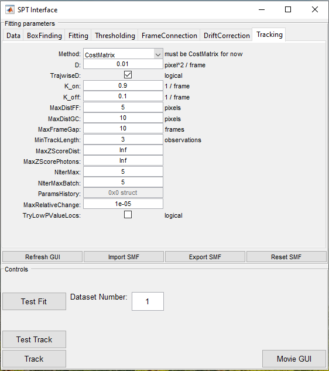
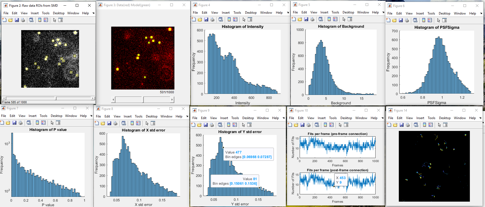
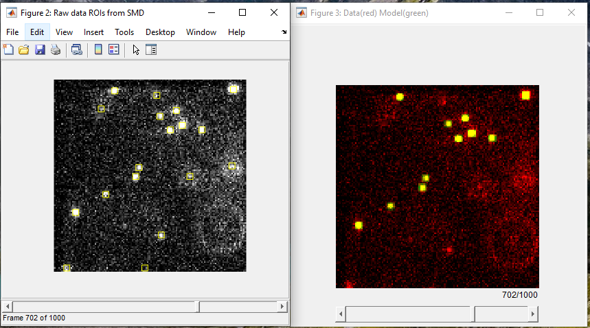
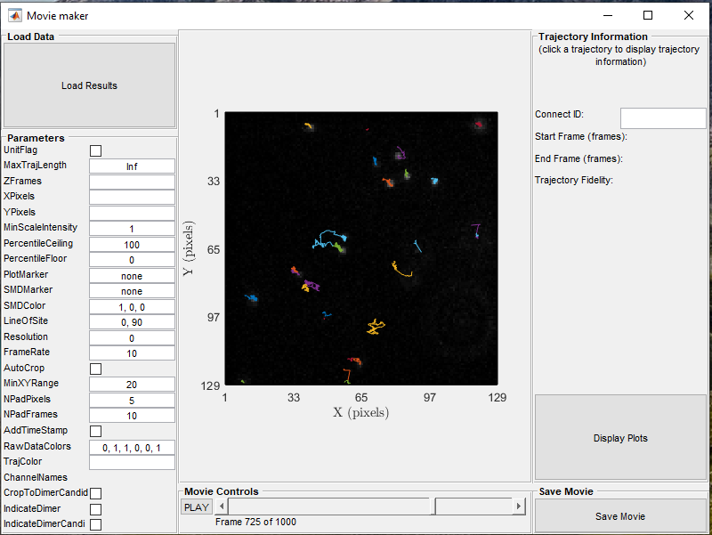

### SPT (Single Particle Tracking)

Single Particle Tracking in ***smite*** allows for robust single 
molecule tracking by creating a TrackingResults (TR) structure, which 
itself is an array of SMD structures, where each array element is an 
SMD structure that corresponds to a single trajectory.

TR structures are organized as follows: each
structure element corresponds to a single trajectory, i.e., TR(n)
contains all relevant properties of the nth trajectory. The TR
structure is intended to carry all necessary information from an SMD
structure (see [smi_core.SingleMoleculeData](../DataStructures/SMD.md)),
but organized in a more user-friendly manner for SPT data.

The TrackingResults structure can be used for subsequent downstream 
data analysis of each trajectory contained in the TR structure, 
e.g., estimating diffusion, HMM analysis, etc.
(see [code examples](../../MATLAB/examples/README.md)).

Single particle tracking in ***smite*** also utilizes the SMF 
(Single Molecule Fitting) structure as described in the
[SMLM writeup](SMLM.md).

Parameters can be modified either in a script for batch tracking of
multiple files (see, for example,
[Example_SPTBatch.m](../../MATLAB/examples/Example_SPTBatch.m))
or through the SPT GUI.

#### Graphical User Interface (GUI) Parameters:

The ***smite*** SPT GUI allows for advanced single particle trajectory
analysis without any programming experience. In this extended example,
we present detailed step-by-step protocols on how to create a TR
structure by either creating a new SMF structure from raw data or
by importing a previously created SMF structure as described in
[SMLM writeup](SMLM.md).

The ***smite*** SPT GUI can be initialized by typing the command `smi.SPT()` 
in MATLAB. 

Figure 1 shows the main SPT GUI Tracking tab interface to create a
TR structure.
*(All other tabs for creating an SMF structure in the SPT GUI are exactly the
same as in the description of the [SMLM GUI](SMLM.md).)*

The components for tracking single molecule data from the SMF structure 
either from a script or through the GUI is briefly explained here.
*(Note that most GUI elements have a tool tip: hover with the mouse over
to the control to display it.)*

 Figure 1. **Tracking** tab.

**Tracking:**     {SPT}

- **Method**:     Method used for tracking. CostMatrix can only be selected as
                  of now. (Default='CostMatrix')
- **D**:          Diffusion Constant (Pixels^2/Frame)  - The known or
                  anticipated diffusion constant of emitters in the raw data.
                  (Default=0.01).
- **TrajwiseD**:  Use traj.-wise value for D (logical) - This allows
                  for trajectory-wise estimated diffusion constants when
                  iteratively tracking. "NIterMax" or "NIterMaxBatch" must be 2
                  or higher. (Default=true)
- **K_on**:       Off to On Rate (Frame^-1) - The known or anticipated rate at
                  which dark emitters become fluorescent, or return from a dark
                  state (e.g., rate at which an out of focus emitter comes intoi
                  view). (Default=.9)

- **K_off**:      On to Off Rate (Frame^-1) - The known or anticipated rate at
                  which emitters transition to a dark state. (Default=.1)

- **MaxDistFF**:  Maximum distance gap for frame-to-frame connection (Pixels) -
                  The maximum separation between localizations such that they
                  can still be considered candidates for the frame-to-frame
                  connection procedure. (Default=5)
- **MaxDistGC**:  Maximum distance gap for Gap Closing (Pixels) - The maximum
                  separation between localizations such that they can still be
                  considered candidates for the gap closing procedure.
                  (Default=10)
- **MaxFrameGap**:Maximum frame gap for Gap Closing (Pixels) - The maximum
                  number of frames elapsed between localizations such that they
                  still can be considered candidates for the gap-closing
                  procedure. (Default=10)
- **MinTrackLength**: Minimum track length of trajectory (Frames) - The minimum
                  number of observations (localizations) a trajectory must have
                  to not be culled after tracking. (Default=3)
- **MaxZScoreDist**:  Max. abs(z-score) x/y jump size - The maximum z-score for
                  jump sizes allowed for trajectory connections. (Default=inf)
- **MaxZScorePhotons**: Max. abs(z-score) for photon diffs. - The maximum
                  z-score for photon differences allowed for trajectory
                  connections. (Default=inf)
- **NIterMax**:   Max. number of iterative tracking attempts (Integer) - The
                  maximum number of iterations permitted if iteratively
                  tracking. (Default=5)
- **NIterMaxBatch**:  Max. number of batch tracking iterations (Integer) - The
                  maximum number of iterations permitted if iteratively
                  tracking over batches. (Default = 5)
- **MaxRelativeChange**: Max. relative param. change to end iterations - The
                  maximum relative change in parameters allowed before ending
                  iterative tracking.(Default = 1e-5)
- **TryLowPValueLocs**: Try to incorporate low p-val. locs. - This allows to
                  track with localizations that were thresholded based on on
                  their p-value. If those localizations are incorporated into
                  trajectories - they are kept, otherwise they are discarded. 
                  (Default=false)

### Single Particle Tracking in ***smite*** walkthrough:

1. Create an SMF structure from raw data as described in the
   [SMLM writeup](SMLM.md) or by importing a previously created SMF structure.
   It is imperative for single particle tracking that the single molecule
   fitting is capturing all wanted emitters throughout the frames being
   analyzed. This can be insured by clicking the "Test Fit" button in
   either the SMLM or SPT GUI. *(Note: Make sure the "Frame Connection"
   is **off**, when performing the Test Fit.)* Various histograms will pop
   up, helping the user optimize their fitting parameters.

 Figure 2. **Test Fit Output.**

2. The tracking tab in the SPT GUI allows the user to adjust the trajectory 
   creation parameters. To test the parameters selected, the user simply has
   to click the "Test Track" button. *(Note: Make sure "Frame Connection" is
   on.)*

 Figure 3. **Test Track Image.**

3. Additionally, movies can be created and saved displaying the overlay of the
   tracking results on top of the raw data by clicking the "Movie GUI" button.
   Tracking results can easily be visualized across the entire sequence.

 Figure 4. **Movie GUI Image.**

4. Once satisfied with the parameters, the user simply has to click the
   "Track" button on the the Tracking tab (see Figure 1).

For batch tracking multiple raw-data files, the user can then adjust
the tracking parameters described above into a script such as
[Example\_SPTBatch.m](../../MATLAB/examples/Example_SPTBatch.m).

Single particle tracking from multiple channels can be accomplished by
importing channel registration results into the script or using the GUI.  

## Tips

Ensuring the SMF structure created is capturing all emitters wanted
from the raw data, by using the SMLM or SPT GUI, is perhaps the most
important step of single particle tracking. Adjusting the SMF parameters
using the "Test Fit" button in the SMLM or SPT GUI allows for quickly
modifying the SMF parameters.

The estimated diffusion constant in pixel^2/frame is constantly iterated
on if TrajwiseD is true.

The "Test Track" button in the GUI makes it easy to adjust the parameters
quickly and see the trajectory overlay on top of the raw data immediately.
This is very helpful if there are multiple files to track.

Once parameters are optimized for the modality being analyzed, it is easy
to modify and save a script for processing multiple files from that modality.

FrameConnection must be on for tracking multiple frames.
